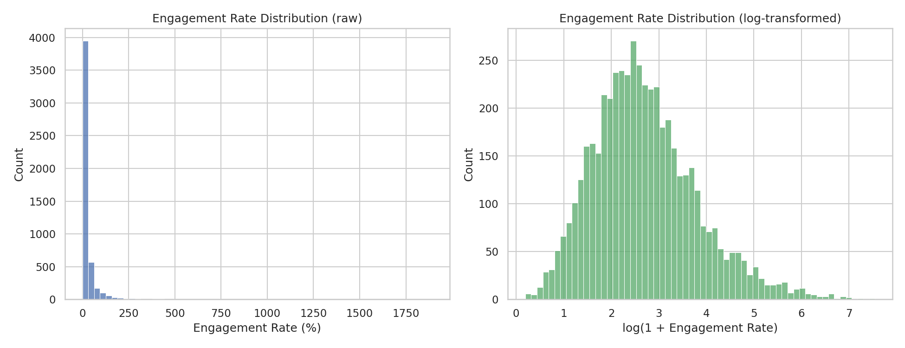
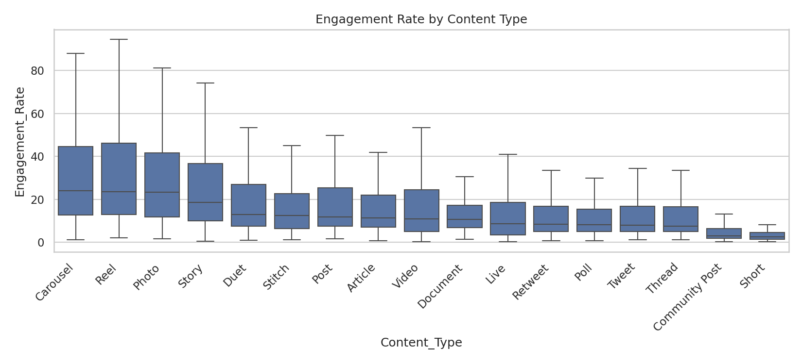
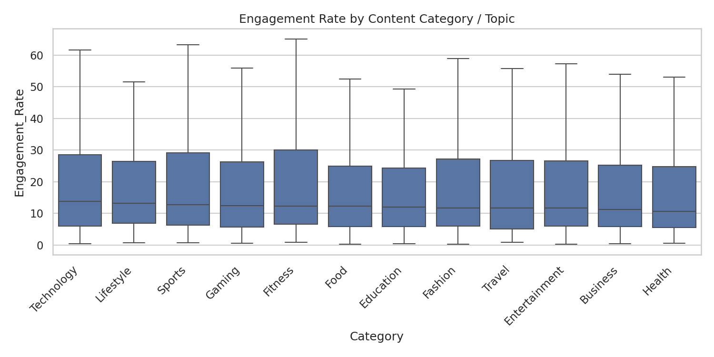
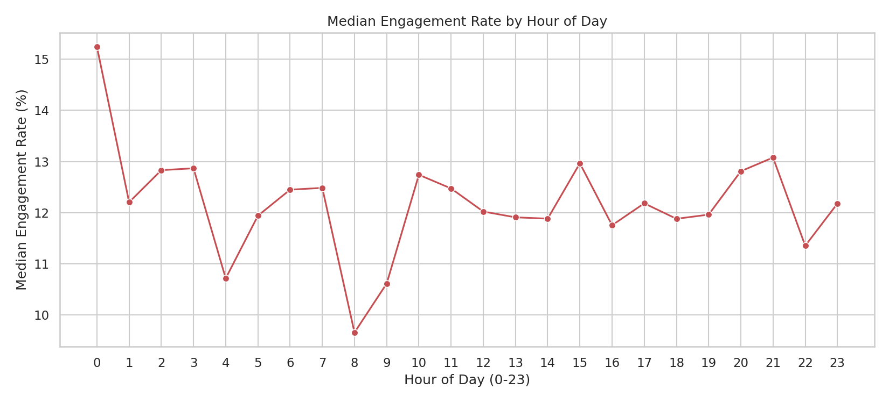
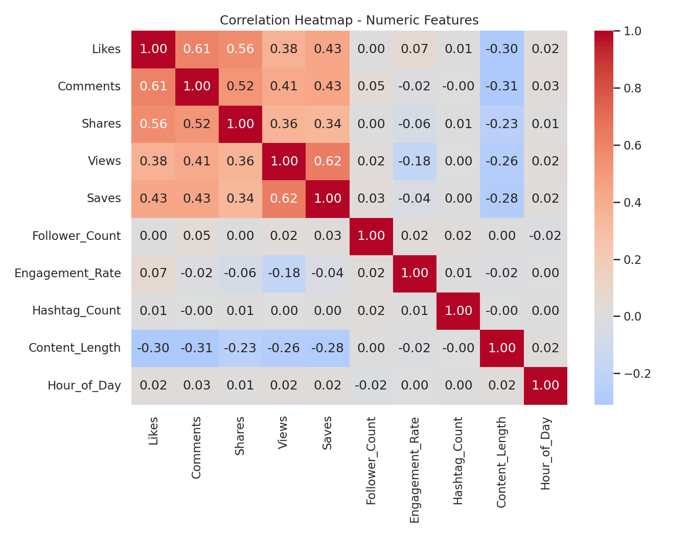
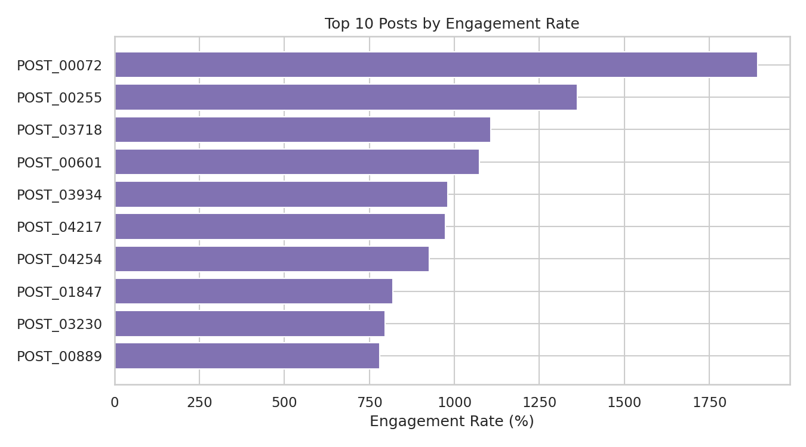
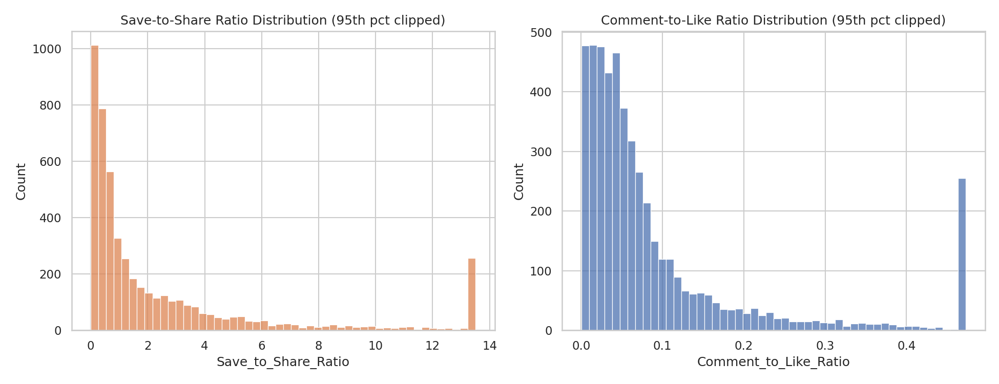

# Module 3 — Exploratory Data Analysis

**Dataset:** `cleaned_engagement_dataset.csv` (5,000 rows, post-cleaning)
**Tools:** Python, Pandas, Matplotlib, Seaborn

This notebook/module explores engagement patterns across content type, topic, posting time, and inter-metric relationships. Every number below comes directly from the cleaned dataset — nothing is estimated.

---

## 1. Distribution of Engagement

| Stat | Value |
|---|---|
| Mean | 31.0% |
| Median | 12.1% |
| Std Dev | 76.1 |
| Max | 1892.2% |
| Skewness | 9.47 |

**Observation:** Engagement rate is heavily right-skewed — most posts sit well below the mean, while a small number of outliers pull the average far above the median.

**Interpretation:** This is the natural signature of viral content: a long tail of very high performers among a much larger base of average posts.

**Business meaning:** A log-transform is necessary before feeding this feature into any ML model (Module 6), otherwise outliers will dominate training.

---

## 2. Engagement by Content Type

| Rank | Content Type | Median Engagement Rate |
|---|---|---|
| 1 | Carousel | 24.07% |
| 2 | Reel | 23.66% |
| 3 | Photo | 23.39% |
| 4 | Story | 18.51% |
| ... | ... | ... |
| 16 | Community Post | 2.99% |
| 17 | Short | 2.55% |

**Observation:** Visually rich, swipeable, or short-video formats (Carousel, Reel, Photo) consistently outperform text-first or micro-content formats.

**Business meaning:** Format choice is one of the strongest levers a content creator has — the gap between the top and bottom format is nearly 10x.

---

## 3. Engagement by Topic / Category

| Rank | Category | Median Engagement Rate |
|---|---|---|
| 1 | Technology | 13.75% |
| 2 | Lifestyle | 13.20% |
| 3 | Sports | 12.73% |
| ... | ... | ... |
| 12 | Health | 10.64% |

**Observation:** The spread across topics (13.75 → 10.64) is much narrower than across content types (24.07 → 2.55).

**Interpretation:** *What* you post about matters far less than *how* you present it.

---

## 4. Engagement by Posting Time

**Top hours by median engagement:** 00:00 (15.2%), 21:00 (13.1%), 15:00 (13.0%)

**Observation:** A modest but real time-of-day effect exists, with midnight and evening hours performing best.

**Business meaning:** Worth noting as a secondary optimization — the effect size here is far smaller than content-type choice, so it shouldn't be oversold as a primary strategy.

---

## 5. Correlation Heatmap

| Pair | Correlation |
|---|---|
| Likes ↔ Comments | 0.61 |
| Shares ↔ Likes | 0.56 |
| Saves ↔ Shares | 0.34 |
| Comments ↔ Engagement Rate | -0.02 |
| Follower Count ↔ Engagement Rate | 0.02 |
| Content Length ↔ Likes | -0.30 |

**Observation:** Raw engagement counts (Likes, Comments, Shares, Saves, Views) are all moderately-to-strongly correlated with each other — posts that get more likes tend to get more of everything else.

**Key finding:** Engagement **rate** is essentially uncorrelated with follower count. Big accounts don't automatically get proportionally higher engagement rates — reach and rate are different things.

**Key finding:** Content length is *negatively* correlated with every raw engagement metric — shorter content tends to perform better here.

---

## 6. Top-Performing Content

The top 10 posts by engagement rate are dominated by **Instagram Carousel/Reel/Photo** posts in the **Food** and **Health** categories — consistent with the content-type finding above.

---

## 7. Save-to-Share and Comment-to-Like Ratios

| Ratio | Median |
|---|---|
| Save-to-Share | 0.90 |
| Comment-to-Like | 0.05 |

**Observation:** Both ratios are right-skewed. A save-to-share ratio near 1 suggests that, on average, content is saved about as often as it's shared — implying two distinct audience behaviors (bookmarking for later vs. amplifying now) that may be worth separate strategies.

---

## Key Takeaways for Strategy (Module 9 preview)

1. **Format > Topic:** Content type explains far more variance in engagement than subject category.
2. **Engagement rate is not just a followers game:** small accounts can out-engage large ones.
3. **Shorter content wins:** Content_Length is negatively correlated with every raw engagement metric.
4. **Outliers matter:** ~11% of posts are statistical outliers on engagement rate — these are the ones a virality model (Module 6) needs to correctly identify.

---

*Source code: `eda.py` (uploaded alongside)*
